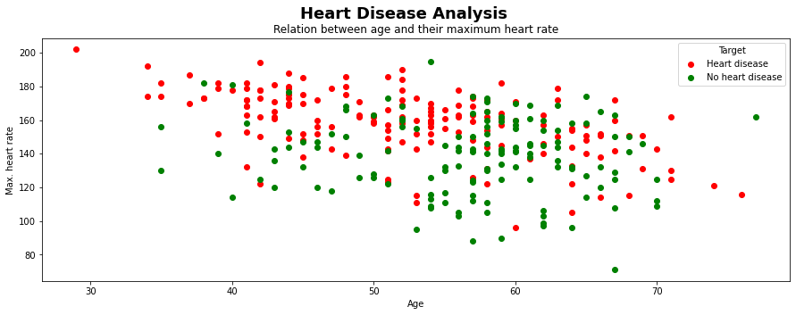
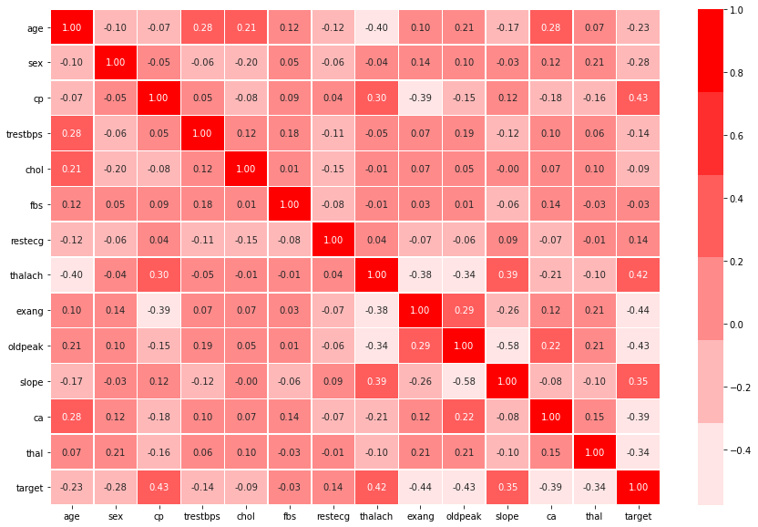

# Heart-Disease-Classifier
Building a machine learning binary-classification model to predict whether or not a patient has heart-disease.

## Tools
The tools used within the jupyter notebook are:

* numpy
* pandas
* matplotlib
* scikit-learn

## Data

TThe data I will be using is from [kaggle](https://www.kaggle.com/ronitf/heart-disease-uci).
The original dataset from the [Cleveland database](https://archive.ics.uci.edu/ml/datasets/heart+Disease) contained way more than 14 features.

For more details please look into the [jupyter notebook](https://github.com/Ritsch1/Heart-Disease-Classifier/blob/development/notebooks/Heart-Disease-Classification.ipynb) or into the [data](https://github.com/Ritsch1/Heart-Disease-Classifier/tree/development/data) folder.

## Preview - Graphical insights from the dataset 

At this point I share some of the insights the EDA revealed. For further graphical insights please 
look into the [jupyter notebook](https://github.com/Ritsch1/Heart-Disease-Classifier/blob/development/notebooks/Heart-Disease-Classification.ipynb) or into the [plots](https://github.com/Ritsch1/Heart-Disease-Classifier/tree/development/plots) folder.

**Previews**

* This scatter plot shows the relation between the age and the maximal heart rate of a patient.

* This correlation - matrix shows the correlation of the medical features of a patient and his diagnosis.

